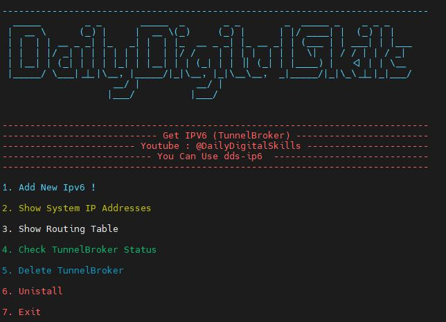

# IPv6 TunnelBroker
 This script helps you easily use TunnelBroker and set your IPv6 on the virtual server.


## About The Project
<p align="center">
  <a href="https://github.com/azavaxhuman/IPTABLE-Tunnel-multi-port">
    
  </a>
</p>

این اسکریپت به شما کمک میکنه تا براحتی IPv6 که با استفاده از سرویس های تانل بروکر دریافت کردید رو روی سرور مجازیتون ست کنید. همینطور به راحتی میتونید تنظیمات رو مشاهده کنید یا اون رو به حالت قبل برگردونید. <br>
<br>
________________________________
<br><br>
✅ بدون نیاز به درگیر شدن با دستورات متعدد <br>
✅ مساهده ip ها , route ها و وضعیت تانل و امکان حذف ipv6 و اینترفیس مربوط به اون از تنظیمات شبکه <br>


<br>

<br>

## Install & Use


<br><br>
نصب: دستور زیر رو وارد کنید ،  اسکریپت نصب و اجرا میشه . توجه کنید که برای اینکه تنظیمات به صورت کامل اجرا بشه نیاز هست که سرور شما در پایان اجرای اسکریپت ریبوت بشه. اسکریپت از شما خواهد پرسید که ریبوت انجام بشه یا خیر . برای هر بار اجرای نرم افزار کافیه دستور dds-ipv6 رو اجرا کنید.
<br>

<br>


```sh
git clone https://github.com/azavaxhuman/IPv6-TunnelBroker.git /root/dds-ipv6 && chmod +x /root/dds-ipv6/install.sh && /root/dds-ipv6/install.sh
```
<br>

 برای هر بار اجرای نرم افزار کافیه دستور dds-ipv6 رو اجرا کنید.
<br>

<br>

```sh
dds-ipv6
```

## YouTube 

You Can find my Videos on Daily Digital Skills Channel . See [YouTube](https://www.youtube.com/@Dailydigitalskills/) for more information.
## License

Distributed under the GPL-3.0 License. See [LICENSE](https://github.com/azavaxhuman/MarzbanInboundGenerator/blob/main/LICENSE.md) for more information.

## Authors

* **AzavaxHuman** - *Daily Digital Skills* - [AzavaxHuman](https://github.com/azavaxhuman) 

